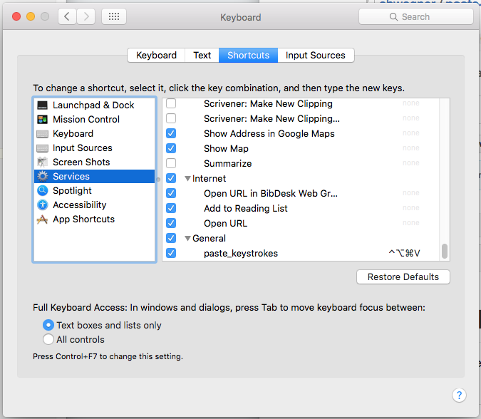
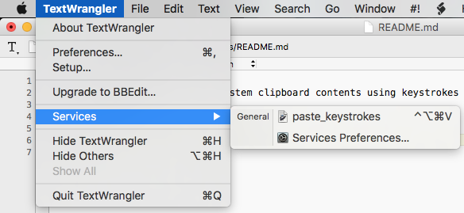

# Paste Keystrokes
An OS X service for pasting system clipboard contents using keystrokes

## Installation

First, install the service:
```shell
# Clone the repository:

clone git@github.com:ahwagner/paste-keystrokes.git
cd paste-keystrokes

# Copy the paste_keystrokes directory to your system services folder:

cp -r paste_keystrokes.workflow ~/Library/Services/
```

(OPTIONAL) Assign a keyboard shortcut:



## Running the Service

The service may be run from the services submenu of any Application Menu 
(in the system menubar):



## Troubleshooting

### Keyboard Shortcut Doesn't Do Anything

After initially installing the service, it may not run from a keyboard shortcut.
For the first use, [run the service](#running-the-service) from the Application Menu in the menubar.

